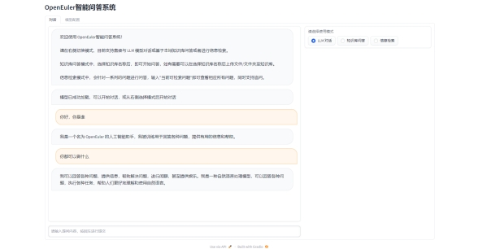
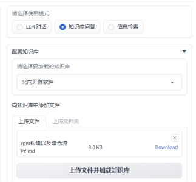
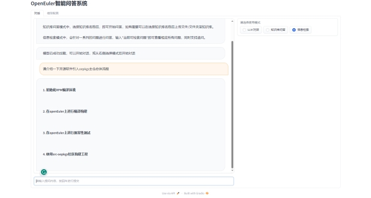
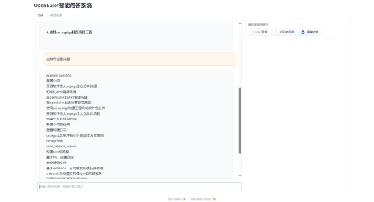

# Opekgs智能问答系统

## 系统简介

基于Opekgs相关内容完成了一个文本机器人服务，该服务利用大模型技术和Chatbot技术，能够在对话中收集关键信息，也可以针对现有知识库对于相关问题进行回答，同时对于准确度要求较高的问题，同时融合了对话和信息检索的技术

## 原理介绍

ChatGLM-6B 是一个开源的、支持中英双语的对话语言模型，基于 [General Language Model (GLM)](https://github.com/THUDM/GLM) 架构，具有 62 亿参数。结合模型量化技术，用户可以在消费级的显卡上进行本地部署（INT4 量化级别下最低只需 6GB 显存）。 ChatGLM-6B 使用了和 ChatGPT 相似的技术，针对中文问答和对话进行了优化。经过约 1T 标识符的中英双语训练，辅以监督微调、反馈自助、人类反馈强化学习等技术的加持，62 亿参数的 ChatGLM-6B 已经能生成相当符合人类偏好的回答。

基于知识库项目参考一种利用 [ChatGLM-6B](https://github.com/THUDM/ChatGLM-6B) + [langchain](https://github.com/hwchase17/langchain) 实现的基于本地知识的 ChatGLM 应用。增加 [clue-ai/ChatYuan](https://github.com/clue-ai/ChatYuan) 项目的模型 [ClueAI/ChatYuan-large-v2](https://huggingface.co/ClueAI/ChatYuan-large-v2) 的支持。 受 [GanymedeNil](https://github.com/GanymedeNil) 的项目 [document.ai](https://github.com/GanymedeNil/document.ai) 和 [AlexZhangji](https://github.com/AlexZhangji) 创建的 [ChatGLM-6B Pull Request](https://github.com/THUDM/ChatGLM-6B/pull/216) 启发，建立了全部基于开源模型实现的本地知识问答应用。

本项目中 Embedding 默认选用的是 [GanymedeNil/text2vec-large-chinese](https://huggingface.co/GanymedeNil/text2vec-large-chinese/tree/main)，LLM 默认选用的是 [ChatGLM-6B](https://github.com/THUDM/ChatGLM-6B)。依托上述模型，本项目可实现全部使用**开源**模型**离线私有部署**。

本模块实现原理如下图所示，过程包括加载文件 -> 读取文本 -> 文本分割 -> 文本向量化 -> 问句向量化 -> 在文本向量中匹配出与问句向量最相似的`top k`个 -> 匹配出的文本作为上下文和问题一起添加到`prompt`中 -> 提交给`LLM`生成回答。


基于信息检索的模块则是通过构建检索对，对于专业领域的问题进行询问，使得回复关键问题的时候答案准确、全面、具体，可操作性强。

🚩 本项目未涉及微调、训练过程，但可利用微调或训练对本项目效果进行优化。

## 硬件需求

- ChatGLM-6B 模型硬件需求
  
    | **量化等级**   | **最低 GPU 显存**（推理） | **最低 GPU 显存**（高效参数微调） |
    | -------------- | ------------------------- | --------------------------------- |
    | FP16（无量化） | 13 GB                     | 14 GB                             |
    | INT8           | 8 GB                     | 9 GB                             |
    | INT4           | 6 GB                      | 7 GB                              |

- Embedding 模型硬件需求

    本项目中默认选用的 Embedding 模型 [GanymedeNil/text2vec-large-chinese](https://huggingface.co/GanymedeNil/text2vec-large-chinese/tree/main) 约占用显存 3GB，也可修改为在 CPU 中运行。


## 开发部署

### 软件需求

本项目已在 Python 3.8 - 3.10，CUDA 11.7 环境下完成测试。已在 Windows、ARM 架构的 macOS、Linux 系统中完成测试。

### 从本地加载模型

从 Hugging Face Hub 下载模型需要先[安装Git LFS](https://docs.github.com/zh/repositories/working-with-files/managing-large-files/installing-git-large-file-storage)，然后运行

```
git clone https://huggingface.co/THUDM/chatglm-6b
```

如果你从 Hugging Face Hub 上下载 checkpoint 的速度较慢，可以只下载模型实现

```
GIT_LFS_SKIP_SMUDGE=1 git clone https://huggingface.co/THUDM/chatglm-6b
```

然后从[这里](https://cloud.tsinghua.edu.cn/d/fb9f16d6dc8f482596c2/)手动下载模型参数文件，并将下载的文件替换到本地的 `chatglm-6b` 目录下。

将模型下载到本地之后，将以上代码中的 `THUDM/chatglm-6b` 替换为你本地的 `chatglm-6b` 文件夹的路径，即可从本地加载模型。

**Optional** 模型的实现仍然处在变动中。如果希望固定使用的模型实现以保证兼容性，可以执行

```
git checkout v1.1.0
```

### 1. 安装环境

#### 系统环境

Ubuntu 20.04

显卡显存要求在4G以上

#### 环境检查

```shell
# 首先，确信你的机器安装了 Python 3.8 及以上版本
$ python --version
Python 3.8.13

# 如果低于这个版本，可使用conda安装环境
$ conda create -p /your_path/env_name python=3.8

# 激活环境
$ source activate /your_path/env_name

# 关闭环境
$ source deactivate /your_path/env_name

# 删除环境
$ conda env remove -p  /your_path/env_name
```

#### 项目依赖

```shell
# 拉取仓库
$ git clone https://gitee.com/openeuler/oec-application/tools/oepkgs-talk-robot

# 安装依赖
$ pip install -r requirements.txt
```

注：使用 `langchain.document_loaders.UnstructuredFileLoader` 进行非结构化文件接入时，可能需要依据文档进行其他依赖包的安装，请参考 [langchain 文档](https://python.langchain.com/en/latest/modules/indexes/document_loaders/examples/unstructured_file.html)。

### 2. 设置模型默认参数

在开始执行 Web UI 或命令行交互前，请先检查 [configs/model_config.py](../../tools/oepkgs-talk-robot/configs/model_config.py) 中的各项模型参数设计是否符合需求。

### 3. 执行脚本体验 Web UI 或命令行交互

> 注：鉴于环境部署过程中可能遇到问题，建议首先测试命令行脚本。建议命令行脚本测试可正常运行后再运行 Web UI。

执行 [cli_demo.py](../../tools/oepkgs-talk-robot/cli_demo.py) 脚本体验**命令行交互**：
```shell
$ python cli_demo.py
```

或执行 [webui.py](../../tools/oepkgs-talk-robot/webui.py) 脚本体验 **Web 交互**

```shell
$ python webui.py
```

注：如未将模型下载至本地，请执行前检查`$HOME/.cache/huggingface/`文件夹剩余空间，至少15G。

执行后效果如下图所示：


Web UI 可以实现如下功能：

1. 运行前自动读取`configs/model_config.py`中`LLM`及`Embedding`模型枚举及默认模型设置运行模型，如需重新加载模型，可在 `模型配置` 标签页重新选择后点击 `重新加载模型` 进行模型加载；
2. 可手动调节保留对话历史长度、匹配知识库文段数量，可根据显存大小自行调节；
3. 具备模式选择功能，可选择 `LLM对话` 、 `知识库问答`和`信息检索` 模式进行对话，支持流式对话；
4. 添加 `配置知识库` 功能，支持选择已有知识库或新建知识库，并可向知识库中**新增**上传文件/文件夹，使用文件上传组件选择好文件后点击 `上传文件并加载知识库`，会将所选上传文档数据加载至知识库中，并基于更新后知识库进行问答；
5. 添加`信息检索`功能，支持对于内置问题实现检索访问，具体通过md文档增量式构建检索对的方式见文档。

## 用户交互

#### 页面1——LLM对话页面

支持直接与大模型进行对话，实现简单问答和功能询问等。

 

该页面主要为对话框和右侧导航栏。左侧对话框展示了系统的一些基本信息和说明情况，同时包含对话框，支持用户进行文本框的输入，对模型进行提问，同时模型会进行推理，在文本框上进行回答，类似于聊天界面。右侧导航栏显示当前模式，为“LLM对话”，支持直接与系统助手进行对话，回答一些基本问题。文本框栏主要包括文本的输入，进行提问，同时会类似于聊天的形式给出回答。

####  页面2——知识库问答界面

支持新建知识库，选择知识库名称后，即可开始问答，如有需要可以在选择知识库名称后上传文件/文件夹至知识库。

 

该页面主要为对话框和右侧导航栏。左侧对话框展示了系统的一些基本信息和说明情况，同时包含对话框，支持用户进行文本框的输入，对模型进行提问，同时模型会进行推理，在文本框上进行回答，类似于聊天界面。右侧导航栏显示当前模式，为“知识库问答”，可以通过新建知识库或者进行知识库的选择，实现文件上传，对于知识库的相关信息进行提问。支持新建知识库

支持文件上传。

 

支持文件夹上传。

 

#### 页面3——信息检索

支持针对一系列的问题进行问答，输入"当前可检索问题"即可查看相应所有问题，同时支持追问。

 

该页面主要为对话框和右侧导航栏。左侧对话框展示了系统的一些基本信息和说明情况，同时包含对话框，支持用户进行文本框的输入，对模型进行提问，同时模型会进行推理，在文本框上进行回答，类似于聊天界面。右侧导航栏显示当前模式，为“信息检索”，针对一系列的问题进行问答，输入"当前可检索问题"即可查看相应所有问题，同时支持追问。

支持查看可检索问题。

 

### 常见问题

参见 [常见问题](../../tools/oepkgs-talk-robot/docs/FAQ.md)。
