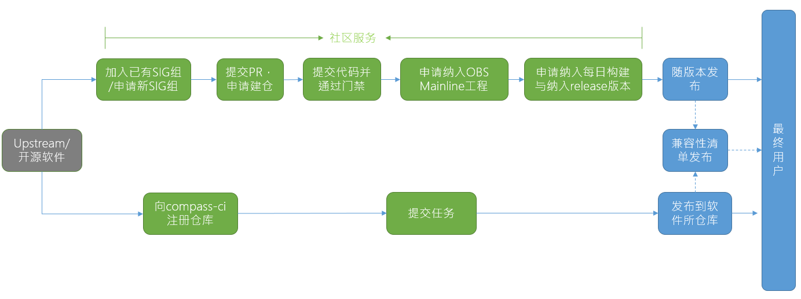

# openEuler社区开源软件适配流程

​	openEuler社区提供2种开源软件适配方式，第一种开源软件随openEuler正式版本发布，所需要的流程以及时间较长，第二种为开源软件兼容性适配及应用，将开源软件发布到[软件所仓库](https://repo.oepkgs.net/openEuler/rpm/openEuler-20.03-LTS-SP1/)，所需要的时间较短。

​	当开源软件存在以下问题时，推荐使用第二种方案，其余推荐随社区版本发布：

- license不合规，如mongodb等

- 只有二进制商业软件，如nvidia驱动等
- 无对应SIG组、社区无对应maintainer维护的软件



# 开源软件随openEuler正式版本发布流程

开源软件在加入SIG组后，建立自己的软件仓库，经过门禁以及各个评审流程，最终随openEuler正式版本发布

## 一、加入SIG组或申请SIG组

新建软件仓库分为两种：新建**原创软件** upstream开源仓库，新引入**其他开源社区开源软件**源码仓库。

**原创开源软件**，选择openEuler作为upstream托管仓库或者**开源软件引入openEuler社区**，作为openEuler社区版本rebuild构建使用，首先需要加入**加入openEuler社区已有sig组**或者申请新的sig组

## 二、提交PR，申请建仓

提交申请建仓PR，TC 及对应sig组review approve后既可自动创建gitee软件仓（CI脚本自动触发）

PR示例：https://gitee.com/openeuler/community/pulls/975/files

## 三、提交代码并通过门禁

**建仓**完成后，根据[openEuler社区打包规范](https://gitee.com/openeuler/community/blob/master/zh/contributors/packaging.md),完成软件包spec撰写/适配，之后新建PR提交代码+spec等完整的包文件，通过门禁检查和单包编译检查
- PR示例：https://gitee.com/src-openeuler/isula-build/pulls/1 

## 四、申请纳入OBS Mainline工程 

在第二步骤中新包在OBS的factory工程下编译成功且稳定后，就可以申请移仓到OBS mainline编译工程中来了，申请PR样例如下


- PR示例：https://gitee.com/src-openeuler/obs_meta/pulls/388/files


## 五、申请纳入每日构建与纳入release版本

申请该包被纳入各个版本开发主干的每日构建ISO交付件构建列表中

- PR示例：https://gitee.com/src-openeuler/mkeuleros/pulls/91

申请该包被纳入各个版本正式release发布的ISO交付件构建列表中，需要在版本分支拉出来之前的需求收集阶段，提需求给release sig，根据openEuler社区质量要求、版本需求接纳原则来评审；

- PR示例：https://gitee.com/openeuler/release-management/issues/I1O7RM?from=project-issue

## 六、随版本发布

需求纳入release版本后，提交PR申请该包纳入release 分支对应的OBS和jenkins编译构建交付件列表，之后随版本发布

# 开源软件随软件所仓库发布流程

适用场景：

- license不合规，如mongodb等
- 只有二进制商业软件，如nvidia驱动等
- 无对应SIG组、社区无对应maintainer维护的软件

但需要快速进行兼容性适配并应用，可以通过compass-ci将开源软件快速发布到软件所仓库

## 一、向Compass-CI注册仓库

### 添加待测试仓库 URL 到 upstream-repos 仓库
根据[仓库注册指南](https://gitee.com/openeuler/compass-ci/blob/master/doc/test-guide/test-oss-project.zh.md)，将想要测试的代码仓信息以 yaml 文件的方式添加到 [upstream-repos](https://gitee.com/compass-ci/upstream-repos) 仓库。

**配置 upstream-repos仓库中的DEFAULTS文件：**

以构建zstd软件包为例，在 upstream-repos/z/zstd/目录下增加DEFAULTS文件：
```
# testbox 指定测试机类型规格，详见：https://gitee.com/compass-ci/lab-z9/tree/master/hosts
# docker_image 指定支持的os及os_version，详见：https://gitee.com/openeuler/compass-ci/blob/master/doc/job/submit/supported-testbox-matrix.md
# custom_repo_name 需要指定上传的软件所仓库名，详见：https://repo.oepkgs.net/openEuler/rpm/openEuler-20.03-LTS-SP1/
submit：
- command：testbox=dc-16g docker_image=openeuler:20.03-LTS-SP1 custom_repo_name=extras rpmbuild.yaml
```

## 二、提交任务 

### 提交PR
在注册仓库中提交PR，一旦注册仓库commit id发生变动，就会触发自动化构建，构建测试完成后，compass-ci会向用户邮件报告测试结果，用户可在 https://compass-ci.openeuler.org/jobs 页面中搜索构建测试结果
### 提交任务
安装compass-ci客户端任务提交工具submit，使用submit手动提交构建测试任务，构建测试完成后，compass-ci会向用户邮件报告测试结果，用户可在 https://compass-ci.openeuler.org/jobs 页面中搜索构建测试结果

## 社区服务Compass-CI会提供如下能力：
## 2.1 compass-ci完成构建测试

构建测试调用脚本：

https://gitee.com/wu_fengguang/lkp-tests/blob/master/tests/rpmbuild

构建测试的测试标准：

- 依赖包安装
- 软件包编译

## 2.2 compass-ci完成兼容性测试

兼容性测试调用脚本：

https://gitee.com/wu_fengguang/lkp-tests/blob/master/tests/install-rpm

兼容性测试的测试标准：

- 安装

- 服务启停

- 命令行调用

- 动态依赖库查询

- 卸载
## 2.3 发布
### 发布软件
compass-ci将所有通过构建测试，兼容性测试的软件包发布至oepkgs仓库 https://repo.oepkgs.net/openEuler/rpm/ 里，用户可直接访问，查找软件包

### 发布清单
compass-ci每日定时筛选oepkgs应用类软件包，将筛选出的软件包信息发布至软件兼容性清单 https://www.openeuler.org/zh/compatibility/ 中

## 三、下载使用软件
以软件包x2openEuler为例，由于该软件包是在openEuler-20.03-LTS-SP1上适配，已经是经过构建测试和安装测试的稳定版本，并由用户贡献(contrib)至oepkgs仓库中，因此，该软件包将会存放在https://repo.oepkgs.net/openEuler/rpm/openEuler-20.03-LTS-SP1/contrib/x2openEuler 仓库中：

**软件仓配置规则：**

在 openEuler-20.03-LTS-SP1 os+epol 的基础上，叠加stable仓库，并调整优先级之后使用
openEuler os+epol  repo        priority=0   （缺省最高）
oepkgs stable repo    priority=100

在/etc/yum.repos.d/目录下增加oepkgs.repo文件：
```
cat > /etc/yum.repos.d/oepkgs.repo << EOF
[stablecontribx2openEulernoarch]
name=stablecontribx2openEulernoarch
baseurl=https://repo.oepkgs.net/openEuler/rpm/openEuler-20.03-LTS-SP1/contrib/x2openEuler/$basearch
enabled=1
gpgcheck=0
priority=100
EOF
```
```
yum update
yum install -y x2openEuler
```
