## 背景介绍
[oepkgs](https://oepkgs.net/zh/) 全称开放软件包服务(Open External Packages Service)，是一个为 openEuler 以及其他 Linux 发行版提供软件包服务和容器镜像服务的第三方社区。
oepkgs 社区提供两种开源软件包适配方式，第一种方式开源软件包的源码合入 [src-oepkgs](https://gitee.com/src-oepkgs) 组织仓下面，由 src-oepkgs 的构建服务对软件包进行构建
测试，兼容性测试，并进入 oepkgs 的[主体仓库](https://repo.oepkgs.net/openEuler/rpm/)中。另一种方式用户通过网页快速构建软件包，软件包进入个人账户下面的某个仓库中。


### 开源软件引入oepkgs主仓总体流程
>**1. 获取到spec文件以及源码文件**

>**2. 在openEuler上进行编译构建**

>**3. 在openEuler上进行兼容性测试**

>**4. 将已经适配好的spec文件以及源码文件存放在src-oepkgs仓库中(建仓流程详见[rpm包构建及建仓流程](https://gitee.com/openeuler/oec-application/blob/master/doc/software-compatibility/rpm%E6%9E%84%E5%BB%BA%E4%BB%A5%E5%8F%8A%E5%BB%BA%E4%BB%93%E6%B5%81%E7%A8%8B.md))**
### 1. 软件包spec及源码文件获取

**1.1 在一些网站上找到软件包的src.rpm包，解压获取spec文件以及软件包的源码文件：**
```
https://pkgs.org/
https://src.fedoraproject.org/projects/rpms/*
https://koji.fedoraproject.org/koji/packages
www.google.com
www.baidu.com
www.bing.com
```
以libvirt 4.5.0版本引入为例，在网上寻找src.rpm包的流程如下图所示：

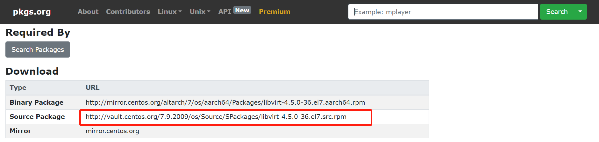
```
rpm -i http://vault.centos.org/7.9.2009/os/Source/SPackages/libvirt-4.5.0-36.el7.src.rpm
```

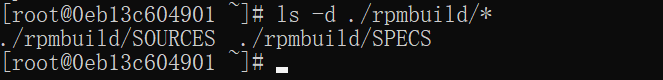
如上图所示的```~/rpmbuild/SPECS/``` 和 ```~/rpmbuild/SOURCES/```目录下面分别存放了软件包的spec文件以及软件包的源码文件

### 2. 在openEuler上进行编译构建：
执行命令，安装构建工具：
```
yum install -y dnf-plugins-core rpm-build
```
执行命令，安装软件包的依赖包
```
# yum-builddep -y ~/rpmbuild/SPECS/*.spec
yum-builddep -y ~/rpmbuild/SPECS/libvirt.spec
```
执行命令，对软件包进行编译构建
```
# rpmbuild -ba ~/rpmbuild/SPECS/*.spec
rpmbuild -ba ~/rpmbuild/SPECS/libvirt.spec
```
编译构建通过就会在 ~/rpmbuild/RPMS/ 目录下面生成 rpm包
```
ls ~/rpmbuild/RPMS/*
```
### 3. 在openEuler上进行兼容性测试
执行命令，测试软件包的安装、卸载
```
yum localinstall ~/rpmbuild/RPMS/x86_64/*
yum remove *
```
执行命令，测试软件包的服务启停
```
systemctl start *
systemctl stop *
```
### 4. 将已经适配好的软件包的spec文件以及~/rpmbuild/SOURCE目录下面的源码文件存放在src-oepkgs仓库中(建仓流程详见[rpm包构建及建仓流程](https://gitee.com/openeuler/oec-application/blob/master/doc/software-compatibility/rpm%E6%9E%84%E5%BB%BA%E4%BB%A5%E5%8F%8A%E5%BB%BA%E4%BB%93%E6%B5%81%E7%A8%8B.md))

## build.oepkgs.net 构建总体流程
>**1. 创建个人软件包仓库**

>**2. 创建并提交构建任务**

>**3. 查看并分析构建日志**

>**4. 在个人仓库中下载使用软件包**
### 1. 创建个人软件包仓库

在rpm包构建之前，我们可以先选择一个已有的软件包仓库地址或新增一个软件包仓库地址去存放我们待构建的软件包。
切换到构建页面，选择 RPM构建  ---> 仓库管理 ---> 新增仓库

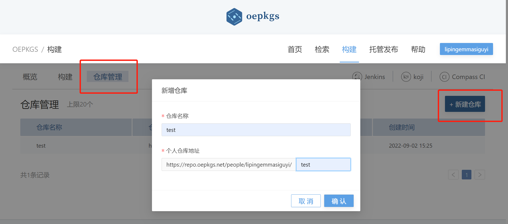

### 2. 新建一个构建任务

通过提交构建任务，编译构建出软件包，并发布到上一步骤创建的仓库中。
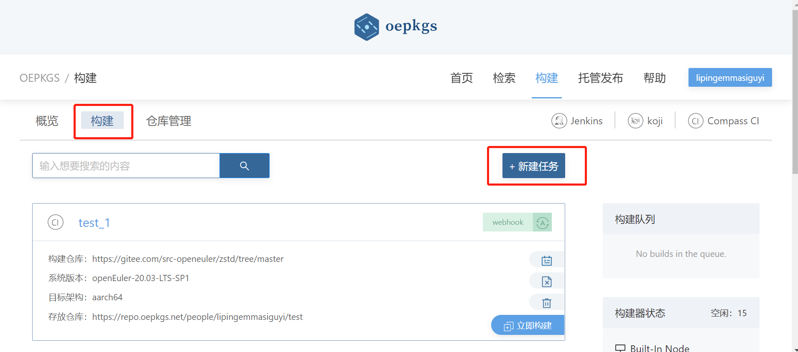

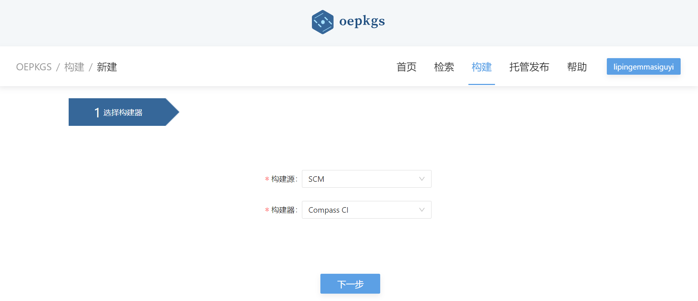


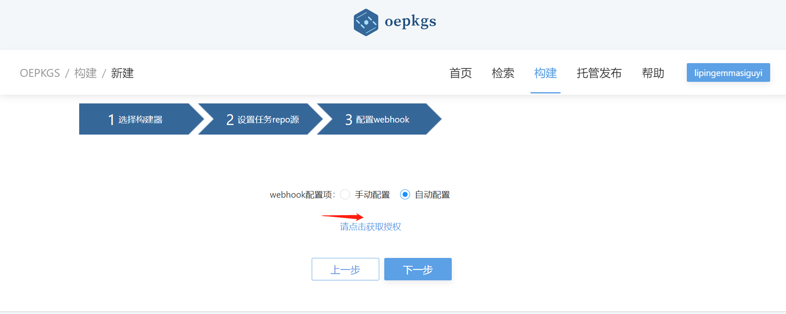

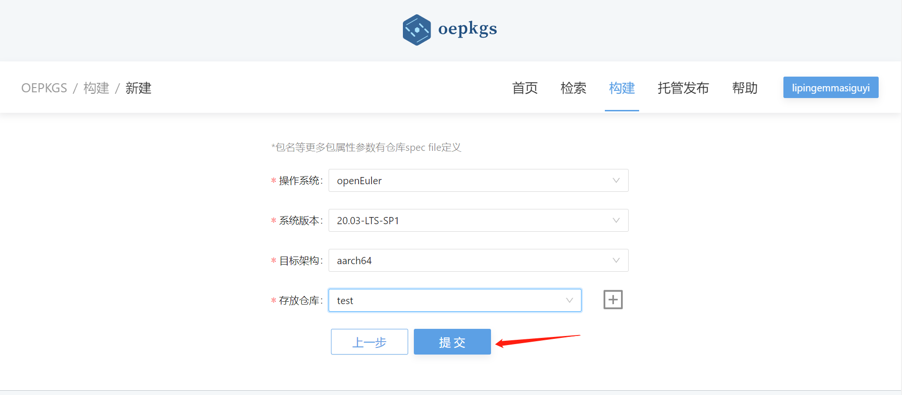

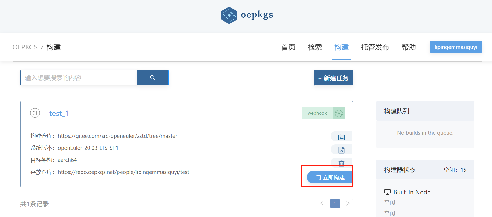

### 3. 查看构建日志
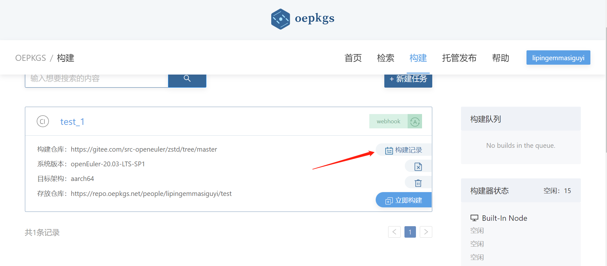

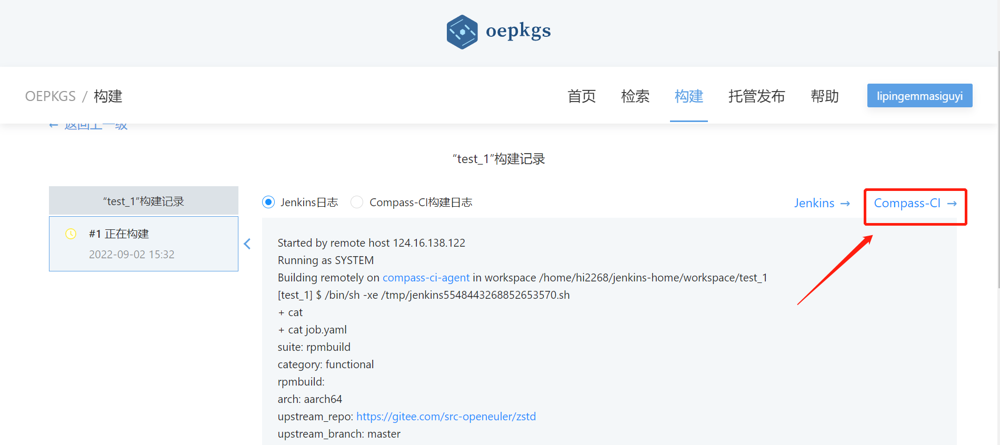

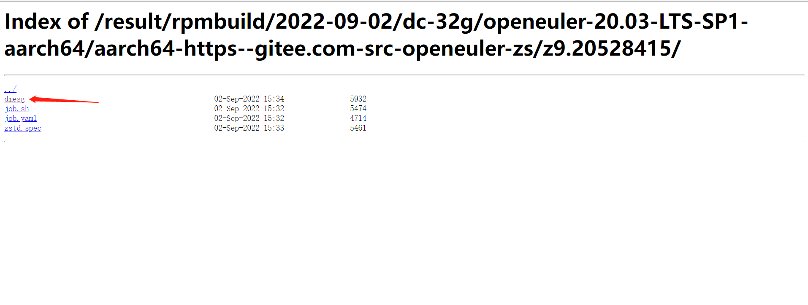
