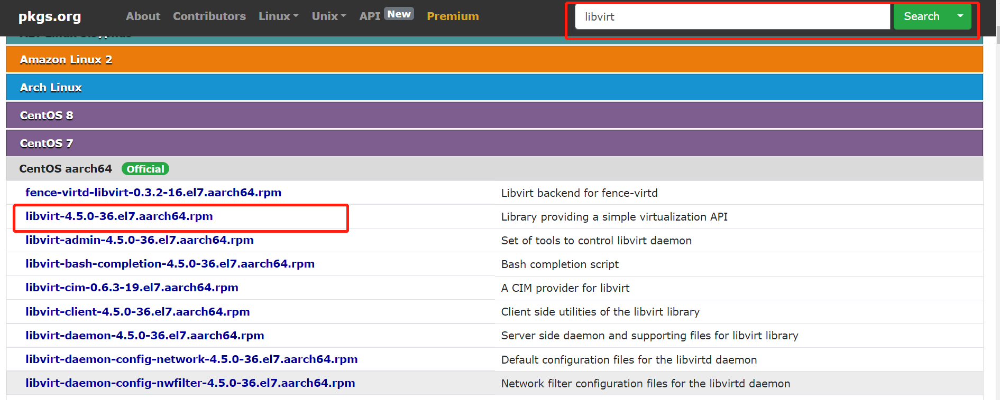
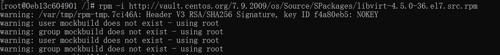

## 适配迁移总体流程
>**1. 获取到spec文件以及源码文件**

>**2. 在openEuler上进行编译构建**

>**3. 在openEuler上进行兼容性测试**

>**4. 将已经适配好的spec文件以及源码文件存放在src-oepkgs仓库中(建仓流程详见[rpm包构建及建仓流程]())**
### 1. 软件包spec及源码文件获取
**1.1 有两种方法可以获取到软件包的spec文件以及源码文件：**

 NO.1 在一些网站上找到软件包的src.rpm包，解压获取spec文件以及软件包的源码文件：
```
https://pkgs.org/
https://src.fedoraproject.org/projects/rpms/*
https://koji.fedoraproject.org/koji/packages
www.google.com
www.baidu.com
www.bing.com
```
以libvirt 4.5.0版本引入为例，在网上寻找src.rpm包的流程如下图所示：


```
rpm -i http://vault.centos.org/7.9.2009/os/Source/SPackages/libvirt-4.5.0-36.el7.src.rpm
```


如上图所示的```~/rpmbuild/SPECS/``` 和 ```~/rpmbuild/SOURCES/```目录下面分别存放了软件包的spec文件以及软件包的源码文件

NO.2 通过二进制rpm包获取软件包的spec文件：