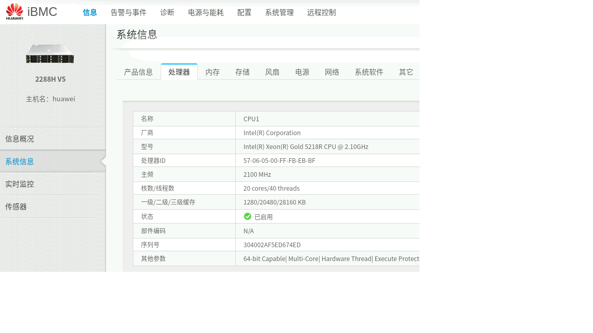

## 如何添加物理测试机并配置lstbox

#### 1. 设置pxe启动
首先确保物理试机已放进compass-ci组网。且ibmc-配置-系统启动项-引导介质有效期：选择永久有效，引导介质选择PXE-保存，且ibmc图形化界面必须配置一个管理员账号crystal，密码Crystal@123456（conserver容器需要，/etc/compass-ci/ipmi_info）
    
  
  

#### 2. 获取mac和hostname
    
在ibmc界面的系统信息中，获取cpu个数、线程数以及内存大小，hostname拼接：服务器型号-cpu个数单个线程数-内存大小(单个内存*个数)--a（arm）/b（x86）    
例如：2288hv5-2s40p-320g--b1004

   
    
#### 3. 注册机器

在ibmc界面的系统信息中，获取连接状态的mac地址

```
cd /c/private-cci/bin/
```
./register-hw-info -n hostname -m mac -q queue（需要注意mac字母大小写以及中间拼接用"-"）
 
例如：

```
 ./register-hw-info -n 2288hv5-2s40p-320g--b1004 -m 54-13-10-53-e4-07 -q 2288hv5-2s40p-320g--b1004，2288hv5-2s40p-320g 
```


#### 4. lstbox设置

为了能够使用lstbox命令查看机器，配置ibmc和z9(crystal)的两个文件/etc/mac2host和/etc/servers.info，以及ibmc上的/etc/hosts，这边需要用到root权限。

```
vi /etc/mac2host
```

pa-1表示机架位子，+mac+hostname

例如：
    9.3.11.4 需要写成pb-4,机架位跟ipmi后两位相关，10以后用a、b、c、d、e代替 

```
vi /etc/servers.info
```


#### 5. 配置conserver
往物理机提交host-info任务，submit +testbox+queue按照注册里填的，将host-info结果文件入库到/c/lab-z9后：

```
ssh root@ibmc-mgnt

cd /c/compass-ci/container/conserver && ./build && ./start
```

