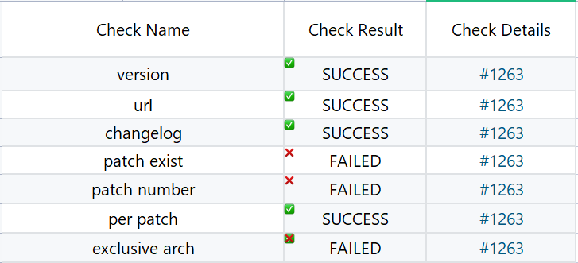

# spec文件规范检查介绍

spec文件是配置规范文件，是RPM软件包编译过程的核心，它说明了软件包如何被配置、打那些补丁、安装哪些文件、安装到哪里、安装过程需要哪些系统级别活动。

- 检查当前版本号是否比上一个commit新
- 检查主页是否可访问
- 检查changelog中的日期错误
- 检查spec中的patch是否存在，及patch的使用情况
- 处理spec文件中patch序号
- 检查spec文件中patch在prep阶段的使用情况
- 保存spec中exclusive arch字段信息



## 规范检查项目
#### 检查当前版本号是否比上一个commit新

```
    def check_version(self):
        """
        检查当前版本号是否比上一个commit新
        :return:
        """
        # need check version？
        if self._only_change_package_yaml():
            logger.debug("only change package yaml")
            return SUCCESS

        self._gp.checkout_to_commit_force("HEAD~1")
        try:
            gr = GiteeRepo(self._repo, self._work_dir, None)  # don't care about decompress
            logger.info("gr.spec_file:%s", gr.spec_file)
            fp = self._gp.get_content_of_file_with_commit(gr.spec_file)
            if fp is None:
                # last commit has no spec file
                return SUCCESS
            spec_o = RPMSpecAdapter(fp)
        finally:
            self._gp.checkout_to_commit_force(self._latest_commit)  # recover whatever

        self._ex_pkgship(spec_o)

        # if lts branch, version update is forbidden
        if self._is_lts_branch():
            logger.debug("lts branch %s", self._tbranch)
            if RPMSpecAdapter.compare_version(self._spec.version, spec_o.version) == 1:
                logger.error("version update of lts branch is forbidden")
                return FAILED
        if self._spec > spec_o:
            return SUCCESS
        elif self._spec < spec_o:
            if self._gp.is_revert_commit(depth=5):  # revert, version back, ignore
                logger.debug("revert commit")
                return SUCCESS

        logger.warning("current version: %s-r%s, last version: %s-r%s",
                       self._spec.version, self._spec.release, spec_o.version, spec_o.release)
        return WARNING
```
#### 检查主页是否可访问

```
    def check_homepage(self, timeout=30, retrying=3, interval=1):
        """
        检查主页是否可访问
        :param timeout: 超时时间
        :param retrying: 重试次数
        :param interval: 重试间隔
        :return:
        """
        homepage = self._spec.url
        logger.debug("homepage: %s", homepage)
        if not homepage:
            return SUCCESS

        for _ in range(retrying):
            if 0 == do_requests("get", homepage, timeout=timeout):
                return SUCCESS
            time.sleep(interval)

        return FAILED
```
#### 

