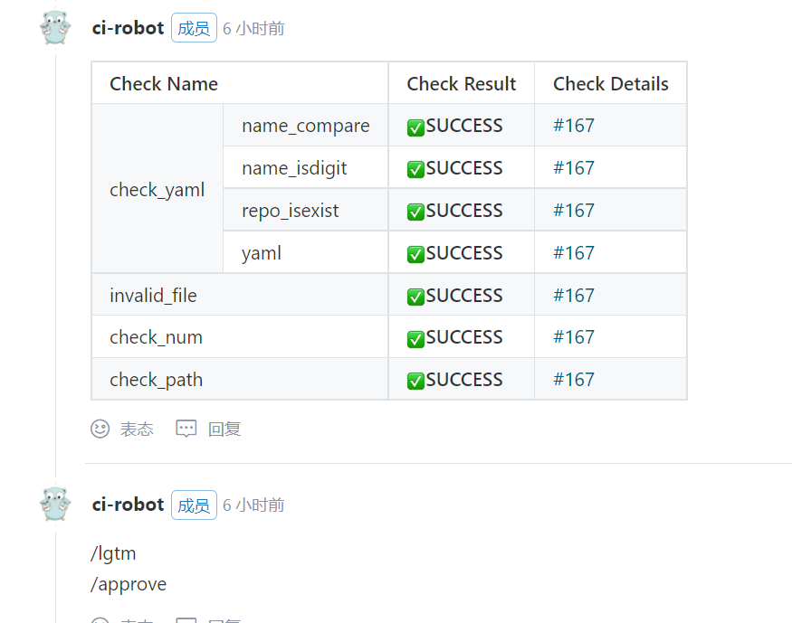

# oepkgs-management仓库门禁介绍


oepkgs-management仓库主要用于存放src-oepkgs组织仓的配置文件。门禁主要支持一下方面功能：
- 验证仓库名是否以数字开头
- 每次提交yaml文件不得超过100(即建仓数量小于100)
- 验证仓库名是否重复
- 验证仓库名是否与yaml文件名一致
- 验证yaml文件是否符合yaml格式规范
- 验证目录层级的正确性


### 流程图


#### Jenkins介绍
Gitee Jenkins Plugin 是码云基于 GitLab Plugin 开发的 Jenkins 插件。用于配置 Jenkins 触发器，接受码云平台发送的 WebHook 触发 Jenkins 进行自动化持续集成或持续部署，并可将构建状态反馈回码云平台。

##### 触发钩子
在webhook服务中获取到oepkgs-management仓库返回的pr消息队列时，触发验证脚本
```
comment.sh
python3 $PATH/pr_comment.py -p $1 -t token -u repo_url -n $2
```

##### Git Clone 仓库
获取仓库中所有内容，以便后续验证新增仓库是否已存在等
```
def clone_repository(cls, sub_dir, repo_url, work_dir=None):
    """
    clone git仓库
    :return: GitProxy() or None
    @param work_dir:
    @param sub_dir:
    @param repo_url: 仓库地址
    """
    repo_dir = os.path.join(work_dir, sub_dir) if work_dir else sub_dir

    clone_cmd = "cd /var/jenkins_home/; git clone {}".format(repo_url)
    ret, _, _ = shell_cmd_live(clone_cmd)

    if not ret:
        logger.warning("clone repository failed, %s", ret)
        return 2

    return cls(repo_dir)
```

##### 获取当前pr的仓库名 get_yaml_list
需要从webhook获取pr的number,通过该api可以获取该pr信息，从而获取yaml文件以及path
```
def get_pr_commit_list(self, pr_num):
    """
    获取此次提交的pr的所有yaml文件的url以及其他信息
    :return:
    """
    api = 'https://gitee.com/api/v5/repos/{}/{}/pulls/{}/files?access_token={}'.format(self._owner, self._repo,
                                                                                       pr_num, self._token)

    yaml_url_list = []

    def analysis(response):
        """
        requests回调，解析pr列表
        :param response: requests response object
        :return:
        """
        handler = response.json()
        for commit in handler:
            yaml_url_list.append(commit.get('raw_url'))

    rs = do_requests("get", api, timeout=10, obj=analysis)
    if rs != 0:
        logger.warning("get pr_commit_list failed")

    return yaml_url_list
```
例如：
```
['https://gitee.com/oepkgs/oepkgs-management/raw/3bf9d5b938017dc50c242ee30a96e7dc469c0598/sig/hpc/sig-info.yaml', 'https://gitee.com/oepkgs/oepkgs-management/raw/3bf9d5b938017dc50c242ee30a96e7dc469c0598/sig/hpc/src-oepkgs/g/glean.yaml']
```

##### 判断包名是否已存在  check_name_is_exist
可以通过git ls-files | grep {} 的方式
```
def check_name_is_exist(self, pr_num):
    """
    check name is exist?
    @param pr_num:
    @return:
    """
    logger.info("start check name is exist in repo ?")
    files_path = self.diff_files_between_commits(pr_num)
    for file_path in files_path:
        yaml_name = file_path.split('/')[-1]
        if yaml_name == "sig-info.yaml" or "yaml" not in yaml_name:
            continue
        get_files_num_cmd = "cd /var/jenkins_home/{}; git ls-files | grep {}".format(self._repo_dir, yaml_name) +\
                            "| awk -F '/' '{print $NF}'" + "| grep  ^{}$".format(yaml_name)
        ret, out, _ = shell_cmd_live(get_files_num_cmd, cap_out=True)
        if not ret:
            logger.error("{} is exist".format(yaml_name))
            return 2
    logger.info("----END CHECK----")
    return 0
```

##### 进行yaml文件验证 check_yaml
```
def analysis(response):
    """
    requests回调
    :param response: requests response object
    :return:
    """
    # noinspection PyBroadException
    try:
        handler = yaml.safe_load(response.text)
        repos.update({item["name"] for item in handler})
    except Exception as err:
        logger.error("yaml file has an error")
        return 2
```

##### 形成报告 report_table
使用python组装html页面，导入校验结果
problem

no problem


```
def _comment_of_ac(self, owner, repo, gitee_token, url):
"""
组装门禁检查结果
:param url: gitee repo address
:return:
"""
acl = {
    "name_compare": GitProxy(repo).check_name(url, self._pr),
    "name_isdigit": GitProxy(repo).check_name_isdigit(self._pr),
    "repo_isexist": GitProxy(repo).check_name_is_exist(self._pr),
    "yaml": GiteeProxy(owner, repo, gitee_token).check_yaml(self._pr),
    "invalid_file": GitProxy(repo).check_invalid_file(self._pr),
    "check_num": GitProxy(repo).check_repo_num(self._pr),
    "check_path": GitProxy(repo).check_file_path(self._pr)
}

comments = []
print("------start check------")
GitProxy(repo).update_repo()
# GitProxy(repo).fetch_pull_request(url, self._pr)
for index, item in enumerate(acl):
    result = acl[item]
    print(item, result)
    ac_result = ACResult.get_instance(result)
    if index == 0:
        comments.append(self.__class__.comment_html_table_tr(
            item, ac_result.emoji, ac_result.hint,
            "{}{}".format("build_url", "console"), 111))
    elif index in [1, 2, 3]:
        comments.append(self.__class__.comment_html_table_tr_rowspan(
            item, ac_result.emoji, ac_result.hint, "{}{}".format("build_url", "console"), 111))
    else:
        comments.append(self.__class__.comment_html_table_tr_colspan(
            item, ac_result.emoji, ac_result.hint, "{}{}".format("build_url", "console"), 111))
    # self.ac_result[item["name"]] = ac_result.hint
print("------end check------")
logger.info("ac comment: %s", comments)

return comments

@classmethod
def comment_html_table_th(cls):
    """
    table header
    """
    return "<tr><th colspan=2>Check Name</th> <th>Check Result</th> <th>Check Details</th></tr>"

@classmethod
def comment_html_table_tr(cls, name, icon, status, href, build_no, hashtag=True):
    """
    one row or span row
    """
    return "<tr><td rowspan=4>check_yaml</td> <td>{}</td> <td>{}<strong>{}</strong></td> " \
           "<td><a href={}>{}{}</a></td></tr>".format(
        name, icon, status, href, "#" if hashtag else "", build_no)

@classmethod
def comment_html_table_tr_rowspan(cls, name, icon, status, href, build_no, hashtag=True):
    """
    span row
    """
    return "<tr><td>{}</td> <td>{}<strong>{}</strong></td>" \
           "<td><a href={}>{}{}</a></td></tr>".format(
        name, icon, status, href, "#" if hashtag else "", build_no)

@classmethod
def comment_html_table_tr_colspan(cls, name, icon, status, href, build_no, hashtag=True):
    """
    span row
    """
    return "<tr><td colspan=2>{}</td> <td>{}<strong>{}</strong></td>" \
           "<td><a href={}>{}{}</a></td></tr></tr>".format(
        name, icon, status, href, "#" if hashtag else "", build_no)

```

html 例：
```
<table style="border-collapse:collapse;word-break:keep-all;white-space:nowrap;font-size:14px;"><tr style="color:#000000;background-color:#EBF4FA;font-size:18px;"><th colspan="2" style="border-color:#000;border-width:1px;border-style:solid;padding:15px;">Check</th><th style="border-color:#000;border-width:1px;border-style:solid;padding:15px;">Result</th></tr><tr><td rowspan="2" style="border-color:#000;border-width:1px;border-style:solid;padding:8px;font-size:15px;">name</td><td style="border-color:#000;border-width:1px;border-style:solid;padding:8px;font-size:15px;">check_name</td><td style="border-color:#000;border-width:1px;border-style:solid;padding:8px;font-size:15px;">success</td></tr><tr><td style="border-color:#000;border-width:1px;border-style:solid;padding:5px;">check_repeat</td><td style="border-color:#000;border-width:1px;border-style:solid;padding:5px;">success</td></tr><tr style="color:#ff0000;"><td colspan="2" style="border-color:#000;border-width:1px;border-style:solid;padding:5px;">check_yaml</td><td style="border-color:#000;border-width:1px;border-style:solid;padding:5px;">failed</td></tr><tr style="color:#ff0000;"><td colspan="2" style="border-color:#000;border-width:1px;border-style:solid;padding:5px;">check_dir</td><td style="border-color:#000;border-width:1px;border-style:solid;padding:5px;">failed</td></tr></table>
```

##### 进行pr评论
```
def do_requests(method, url, body=None, timeout=30):
    """
    http request
    :param method: http method
    :param url: http[s] schema
    :param body: json
    :param timeout: second
    :return:
    """
    try:
        logger.debug("http requests, %s %s %s", method, url, timeout)
        logger.debug("body: %s", body)

        if method.lower() not in ["get", "post", "put", "delete"]:
            return -1

        func = getattr(requests, method.lower())
        rs = func(url, json=body, timeout=timeout)

        logger.debug("status_code %s", rs.status_code)

        if rs.status_code not in [requests.codes.ok, requests.codes.created, requests.codes.no_content]:
            return 1


def comment_pr(self, num, comment):
    """
    评论pull request
    :param num: 本仓库PR的序数
    :param comment: 评论内容
    """
    logger.debug("comment pull request %s", num)
    comment_pr_url = f"https://gitee.com/api/v5/repos/oepkgs/oepkgs-management/pulls/{num}/comments"
    data = {"access_token": self.access_token, "body": comment}

    print(data)
    do_requests("post", comment_pr_url, body=data, timeout=10)
    return True
```

#####
用户根据pr评论日中日志来修改commit


