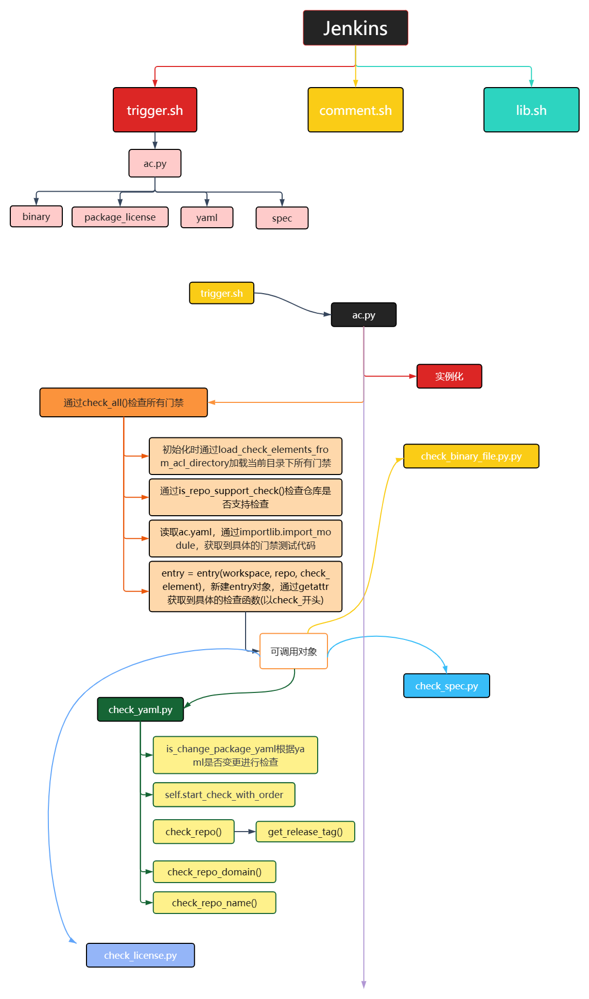

# 一、门禁功能介绍

### 1. 门禁功能
oepkgs (Open External Packages Service) 是一个为 openEuler 操作系统以及其他 Linux 发行版提供软件包服务和容器镜像服务的公共社区。为了保证软件包质量，构建者在gitee提交PR时，会自动触发门禁执行编码规范检查，最后将门禁检查结果返回到PR评论中，帮助开发者定位问题。

门禁代码开源[https://gitee.com/openeuler/openeuler-jenkins](https://gitee.com/openeuler/openeuler-jenkins)

### 2. src-openeuler 门禁检查项
#### 2.1 门禁触发方式
首次提交 PR，或评论/retest

#### 2.2 门禁开始运行标志

#### 2.3 门禁检查结果


# 二、执行流程

#### 2.1. Trigger.sh脚本

此脚本主要分为三个步骤

1、下载oepkgs源码

2、执行静态检查（license，spec等）

3、执行额外操作，目前只有pkgship仓库需要额外操作

ac.py文件主要在第二步中执行

```shell
function exec_check() {
  log_info "***** Start to exec static check *****"
  export PYTHONPATH=${shell_path}
  python3 ${shell_path}/src/ac/framework/ac.py \
    -w ${WORKSPACE} -r ${giteeRepoName} -o acfile -t ${GiteeToken} \
    -p ${giteePullRequestIid} -b ${giteeTargetBranch} -a ${GiteeUserPassword} \
    -x ${prCreateTime} -l ${triggerLink} -z ${jobTriggerTime} -m "${comment}" \
    -i ${commentID} -e ${giteeCommitter} --jenkins-base-url ${jenkins_api_host} \
    --jenkins-user ${jenkins_user} --jenkins-api-token ${jenkins_api_token}
  log_info "***** End to exec static check *****"
}
```
## 说明

```python
self._ac_check_elements
```

```json
{
	'spec': {
		'hint': 'check_spec_file',
		'module': 'spec.check_spec',
		'entry': 'CheckSpec',
		'ignored': ['homepage']
	},
	'code': {
		'hint': 'check_code_style',
		'module': 'code.check_code_style',
		'entry': 'CheckCodeStyle',
		'exclude': True,
		'ignored': ['patch']
	},
	'package_yaml': {
		'hint': 'check_package_yaml_file',
		'module': 'package_yaml.check_yaml',
		'entry': 'CheckPackageYaml',
		'ignored': ['fields']
	},
	'package_license': {
		'hint': 'check_package_license',
		'module': 'package_license.check_license',
		'entry': 'CheckLicense'
	},
	'binary': {
		'hint': 'check_binary_file',
		'module': 'binary.check_binary_file',
		'entry': 'CheckBinaryFile'
	},
	'sca': {
		'exclude': True
	},
	'openlibing': {
		'exclude': True
	}
}

{
	'version_control': 'git',
	'src_repo': 'https://code.wireshark.org/review/gitweb?p=wireshark.git',
	'tag_prefix': '^v',
	'seperator': '.'
}
```


## 2 package yaml

函数调用关系图


此文件夹中包含两个python文件

**1 check_yaml.py**

检查软件包中的yaml文件

| 类方法/属性            | 描述                   | 作用说明                                                     |
| ---------------------- | ---------------------- | ------------------------------------------------------------ |
| __init__               | 初始化                 | CheckPackageYaml实例化对象，初始设置一些参数值               |
| is_change_package_yaml | 判断是否更改了yaml文件 | 如果本次提交变更了yaml，则对yaml进行检查                     |
| check_fields           | 检查fileds             | 从具体的目标分{tbranch}支下载源码及关联仓库代码，编译软件包、比较软件包差异也需目标分支参数 |
| check_repo             | 检查repo               | 检查yaml的有效性,能否从上游社区获取版本信息                  |
| check_repo_domain      | 检查repo作用域         | 检查spec中source0域名是否包含yaml的version_control,仅做日志告警只返回SUCCESS(autoconf为特例) |
| check_repo_name        | 检查repo名称           | 检查spec中是否包含yaml中src_repo字段的软件名,仅做日志告警只返回SUCCESS |
| __call__               | ·                      | 使CheckPackageYaml的实例对象变为了可调用对象                 |

# 三、trigger阶段参数列表
| 参数名               | 默认值                           | 描述                                           | 来源            |
| -------------------- | -------------------------------- | ---------------------------------------------- | --------------- |
| repo_server          | 121.36.53.23                     | repo地址，用来存储工程之间共享的文件服务器     | 自定义          |
| giteeRepoName        | repository.name                  | gitee仓库名                                    | Webhook         |
| giteePullRequestIid  | pull_request.number              | prid                                           | Webhook         |
| giteeSourceBranch    | pull_request.head.ref            | PR源代码分支                                   | Webhook         |
| giteeTargetBranch    | pull_request.base.ref            | PR目标代码分支                                 | Webhook         |
| giteeSourceNamespace | pull_request.head.repo.namespace | PR源命名空间（openeuler/src-openeuler/用户名） | Webhook         |
| giteeTargetNamespace | pull_request.base.repo.namespace | PR目标命名空间（openeuler/src-openeuler/用户名 | Webhook         |
| giteeCommitter       | pull_request.user.login          | 提交人                                         | Webhook         |
| comment              | comment.body                     | 评论内容                                       | Webhook         |
| commentID            | comment.id                       | 评论id                                         | Webhook         |
| jobTriggerTime       | comment.updated_at               | 门禁触发时间                                   | Webhook         |
| prCreateTime         | pull_request.created_at          | PR创建时间                                     | Webhook         |
| triggerLink          | comment.html_url                 | 触发门禁的评论url                              | Webhook         |
| jenkins_user         | jenkins_api_token                | jenkins api的用户名和token                     | jenkins凭证设置 |
| GiteeToken           | openeuler-ci-bot                 | openeuler-ci-bot 评论gitee api token           | jenkins凭证设置 |
| SaveBuildRPM2Repo    | jenkins凭证设置处获取            | sshkey（将打包结果保存到repo的ssh key）        | jenkins凭证设置 |
| GiteeUserPassword    | openeuler_ci_bot                 | 获取代码账号                                   | jenkins凭证设置 |