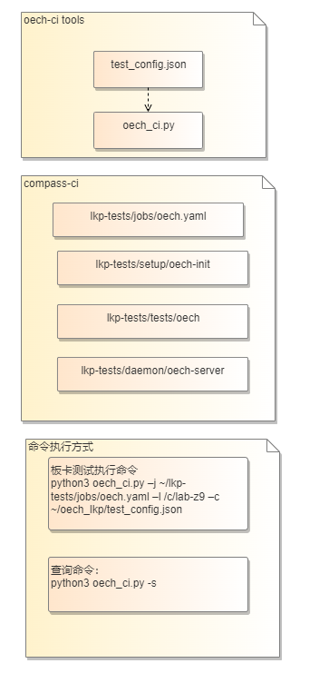
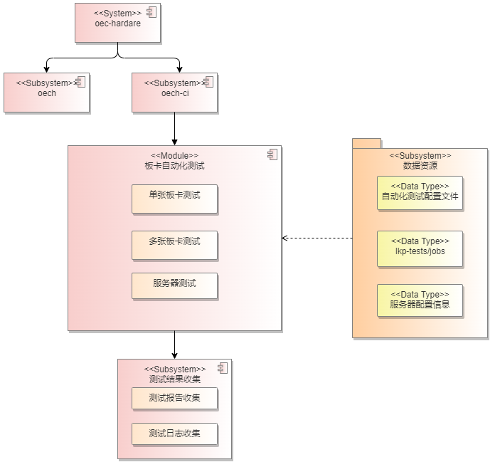

<!-- TOC -->

- [概述](#概述)
- [需求描述](#需求描述)
- [系统设计](#系统设计)
    - [设计原则](#设计原则)
    - [设计方案](#设计方案)
        - [开发视图](#开发视图)
        - [逻辑视图](#逻辑视图)
        - [序列图](#序列图)
        - [开发视图](#开发视图)
- [接口设计](#接口设计)
    - [oech_ci接口清单](#oech_ci接口清单)
    - [lkp-tests接口清单](#lkp-tests接口清单)

<!-- /TOC -->

# oech-ci设计文档

## 概述

[oec-hardware](https://gitee.com/openeuler/oec-hardware) 是硬件兼容性测试工具，在测试硬件时，需要通过人工部署硬件环境才能进行测试，通过将实验室板卡固化到 [compass-ci](https://gitee.com/openeuler/compass-ci) 的环境上，将 oec-hardware 工具集成到 compass-ci 中，通过 [lkp-tests](https://gitee.com/wu_fengguang/lkp-tests) 执行任务，实现自动化测试板卡，从而达到减少人工部署板卡环境的工作量，提高板卡测试效率的目的。

## 需求描述

1. 指定单张板卡进行测试；

2. 指定多张板卡进行测试；

3. 指定服务器测试该服务器上的所有板卡；

## 系统设计

### 设计原则

1.	数据与代码分离：

    （1）测试的板卡数据（板卡型号、四元组信息）由用户进行指定，作为配置项，不在代码中写死；

    （2）服务端配置数据由数据库管理，和oech-ci代码分离；

    （3）配置项由配置文件管理，无需用户交互；

2.	oech-ci与oec-hardware工具分离

    oec-hardware工具手动执行分离解耦；oech-ci自动化执行前的环境准备在compass-ci中实现，和oec-hardware工具解耦。

### 设计方案

#### 开发视图

#### 逻辑视图

#### 接口设计序列图

#### 运行流程设计图

## 接口设计

### oech_ci接口清单

#### 1.1 外部接口

##### 1.1.1 外部接口清单

1. 任务执行方式

        cd oech-ci/main

        python3 oech_ci.py -j $LKP_SRC/jobs/oec-hardware.yaml -l /home/user/lab-z9 -c ../config/test_config.json

* 必选参数

    -j / --job_yaml
        
        oec-hardware的job yaml，文件主要路径为 lkp-tests/jobs/oec-hardware.yaml
    
    -l / --lab_path
    
        测试机环境的库，实验室测试环境主要存放于/c/lab-z9
    
    -c / --card_conf
    
        板卡配置文件 test_config.json

* 可选参数

    -o / --submit_output

        调试参数，输出处理好的yaml, 不提交任务

* 输出
    
        job ids
    
        job yaml文件

2. 查询执行方式

        python3 oech_ci.py -s

* 必选参数

    -s / --search

        不指定参数时查询当前任务状态
        
        指定 group_id 查看对应group的任务执行状态、执行时间

        指定 all 查询历史任务执行时间

* 输出

        任务状态、历史任务执行时间（包括之前执行命令的次数、任务执行时间、每次测试的板卡数量、测试的版本信息）

##### 1.1.2 外部接口的配置文件

test_config.json

* 必选参数

    "os": OS名称，compass-ci支持的操作系统

    "os_arch": 机器架构，compass-ci支持的架构aarch64/x86_64

    "os_version": OS版本信息，compass-ci支持的版本

    "card_info": 板卡信息，四元组信息必填

* 可选参数

    "server"：对于网卡测试，该参数为必选参数，用于指定服务端机器；非网卡测试无需指定；

    "client": 对于网卡测试，该参数为必选参数，用于指定客户端机器；非网卡测试，该参数为可选参数，指定该参数时可以指定测试机器，在不指定时随机选择满足条件的机器进行测试；

* 配置文件示例

        {
            "os":"openeuler",
            "os_arch":"aarch64",
            "os_version":"20.03-LTS-SP3",
            "card_info":
            [
                {
                    "type":"ethernet",
                    "boardModel":"SP331",
                    "vendorID":"8086",
                    "deviceID":"1563",
                    "svID":"19e5",
                    "ssID":"d11a",
                    "driverLink":"inbox"，
                    "server": "taishan200-2280-2s64p-128g--a112",
                    "client": "taishan200-2280-2s64p-128g--a113"
                }
            ]
        }

#### 1.2 内部接口

##### 1.2.1 内部接口清单

|模块 | 接口名称 | 接口描述 | 分类 | 
| -- | -- | -- | -- |
| 测试环境获取模块 | deal_card_info | 处理配置文件中的板卡信息，提取四元组信息，用于后续和测试机环境进行对比 | 内部模块间调用的接口，调用test_config.json文件 |
| 测试环境获取模块 | read_lab_board | 获取测试机环境中所有的板卡四元组信息 | 使用compass-ci的接口/c/lab-z9/devices |
| 测试环境获取模块 | choose_box | 随机获取板卡所在的测试机组成集群 | 内部模块间调用的接口 | 
| 任务执行模块 | get_submit_args | 获取执行job submit命令所需的OS信息 | 内部模块间调用的接口 |
| 任务执行模块| oech_task | 组装成完整的submit命令，提交执行job | 使用lkp-tests提供的接口submit |
| 查询模块 | search_task | 查询任务执行的时间、历史任务执行的时间 | 使用compass-ci提供的接口cci search | 

##### 1.2.2 测试环境获取模块

deal_card_info

* 描述

    处理配置文件中的板卡信息，提取四元组信息，用于后续和测试机环境进行对比。调用配置文件test_config.json。

* 输入

    card_info_list： 板卡信息（必要信息为板卡四元组信息）

* 输出

    card_ids_hash：指定测试的板卡四元组信息

        {
            vendorID-deviceID-ssID-svID: {
                'boardModel': 'SP580',
                'deviceID': '1822',
                'name': 'ethernet',
                'ssID': 'd136',
                'svID': '19e5',
                'vendorID': '19e5',
                }
            ...
        }

read_lab_board

* 描述

    获取测试机环境中所有的板卡四元组信息，调用compass-ci的接口文件/c/lab-z9/devices。

* 输入

    path：实验室测试机所在的环境路径，比如：/c/lab-z9

* 输出

    box_board_hash: 测试机上所有的板卡四元组信息

        {
            'taishan200-2280-2s64p-128g--a116': dict_keys(['10df-e200-e280-10df', '15b3-1007-0006-15b3']),
            'taishan200-2280-2s64p-128g--a117': dict_keys(['10df-e200-e280-10df', '15b3-1007-0006-15b3']),
            'taishan200-2280-2s64p-256g--a110': dict_keys(['19e5-1822-d136-19e5', '8086-159b-0003-8086']),
            'taishan200-2280-2s64p-256g--a111': dict_keys(['19e5-1822-d136-19e5', '8086-159b-0003-8086']),
            'taishan200-2280-2s64p-256g--a119': dict_keys(['19e5-1822-d136-19e5', '8086-159b-0003-8086'])
        }

choose_box

* 描述

    判断是否指定机器进行测试：

    1. 如果指定机器，使用指定的机器，如果测试板卡类型为网卡，需要指定两台机器形成集群；

    2. 如果没有指定机器，测试板卡为非网卡，随机获取一台满足条件的测试机器；

    3. 测试机器集群可以跨架构（arm/x86）

* 输入

    card_ids_hash：指定测试的板卡四元组信息
    
    box_board_hash: 测试机上所有的板卡四元组信息

* 输出

    card_with_box：满足条件的测试机

        {
            '19e5-1822-d136-19e5': 
            {
                'name': 'ethernet',
                'boardModel': 'SP331',
                'test_para': 'y',
                'server': 'taishan200-2280-2s64p-256g--a111',
                'client': 'taishan200-2280-2s64p-256g--a119',
                'env_ready': True
            }
        }

##### 1.2.3 任务执行模块

get_submit_args

* 描述

    使用lkp-tests提供的submit接口，将测试用的参数组装成submit命令。

* 输入

    card_info_hash： 配置文件test_config.json，处理和OS相关的信息

* 输出

    submit_args： submit命令需要的"os", "os_version", "os_arch"参数值

        os=openeuler os_version=22.03-LTS os_arch=aarch64

oech_task

* 描述

    使用lkp-tests提供的submit接口，将获取的测试机信息、OS信息组装成完整的submit命
    令，提交执行job。

* 输入

    yaml_content：lkp-tests/jobs/oec-hardware.yaml job执行文件
    
    card_with_box：满足条件的测试机
    
    submit_args：submit命令需要的"os", "os_version", "os_arch"参数值
    
    submit_output：调试参数，默认为False；如果传参为True，表示不会将任务提交到测试机执行

* 输出

    group id
    
    jobs id

##### 1.2.3 查询模块

search_task

* 描述

    使用compass-ci提供的cci search接口，查询任务状态、历史任务执行时间（包括之前执行命令的 次数、任务执行时间、每次测试的板卡数量、测试的版本信息）

    数据库：复用compass-ci的数据库
  
* 输入

    默认输入为当前执行任务的group id，可查询当前任务的信息；

    输入指定为group id时，可查询指定group的信息；

    输入指定为all时，可查询历史任务的执行信息；

* 输出

    任务的执行状态、执行时间、测试的板卡数量、测试的版本信息

    历史任务的执行信息

### lkp-tests接口清单

|模块 | 接口名称 | 接口描述 |
| -- | -- | -- |
| lkp-tests 和 compass-ci 调度的接口 | lkp-tests/jobs/oec-hardware.yaml | 测试任务提交配置文件 | 
| lkp-tests 框架和 oec-hardware 的接口 | lkp-tests/distro/depends/oec-hardware | 服务端和测试端构建测试用例依赖包文件 |
| lkp-tests 框架和 oec-hardware 的接口 | lkp-tests/daemon/oec-hardware-server | 服务端测试环境准备及执行脚本 |
| lkp-tests 框架和 oec-hardware 的接口 | lkp-tests/tests/oec-hardware | 客户端测试环境准备及执行脚本 |

#### 2.1 lkp-tests/jobs/oec-hardware.yaml 接口交互

* 描述：

    lkp-tests用于提交job的配置文件。该文件会提供给compass-ci，等待compass-ci调度。加载到任务队列，调度后由compass-ci执行。

* 输入
 
    oec-hardware.yaml

    处理：由lkp-tests提交该任务
        
        submit oec-hardware.yaml testbox os os_version os_arch

* 输出

    submit命令发送到compass-ci，由compass-ci返回job id

#### 2.2 lkp-tests/daemon/oec-hardware-server 接口交互

* 描述

    服务端测试环境准备及执行，安装部署oec-hardware-server服务端。

* 输入

    test_card_id：板卡四元组id

    test_card_type：板卡类型

    test_card_name：板卡型号

* 输出

    无。

#### 2.3 lkp-tests/test/oec-hardware 接口交互

* 描述

    客户端测试环境准备及执行。

* 输入

    test_card_id：板卡四元组id

    test_card_type：板卡类型

    test_card_name：板卡型号

    driverlink：驱动下载链接（inbox/outbox）

* 输出

    upload_files：oec-hardware执行生成的html测试报告、测试日志
