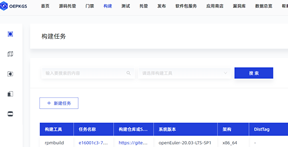
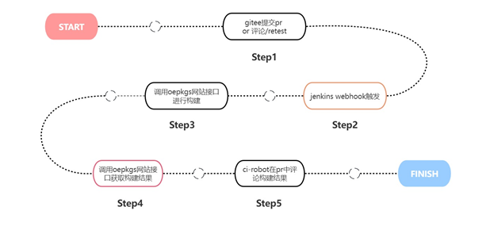
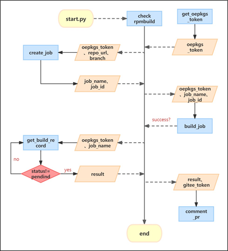
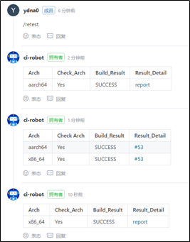
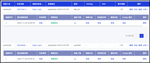

### oepkgs门禁迁移

#### 背景概述

##### 问题背景与分析

oepkgs门禁构建检查不稳定，出现机器资源问题、compass-ci服务问题等，无法得到正确结果。由此导致了用户引入oepkgs软件包无法获取正确的构建结果反馈。

oepkgs门禁存在的问题包括偶发性的问题如网络问题；自动化构建流程无法成功如需要root权限构建、需要大规格机器构建；pr合入后未成功引入软件包，这可能是偶发因素导致，如网络问题，可能是compass-ci服务出了问题；compass-ci自身存在的问题，如机器资源问题、测试结果写入数据库失败的问题等等。

分析问题原因：

1、该oepkgs门禁构建检查服务在本地服务器z9用compass-ci实现，不稳定

2、compass-ci自身存在的问题导致服务经常出问题，如机器资源问题、测试结果写入数据库失败

##### 解决方案

希望使用oepkgs网站实现oepkgs门禁rpm构建检查。

希望调用软件所的oepkgs网站的api接口实现oepkgs门禁构建检查，增强门禁稳定性，实现与现有的compass-ci门禁测试的双重保障。

#### 设计概述

##### 整体方案设计

首先，通过gitee提交pr或评论/retest，jenkins webhook触发，调用oepkgs网站接口进行构建，构建成功后调用oepkgs网站接口获取构建结果，最后由ci-robot在pr评论返回构建结果。

##### 流程设计

具体流程设计：

①  get_oepkgs_token获取token  

②  create_job创建构建任务

③  build_job开始构建            

④  get_build_record获取构建结果

⑤  comment_pr进行评论

#### 功能设计

希望设计实现的功能：

① 将构建结果返回到pr评论中

② oepkgs网站自动进行rpm构建

最后实现oepkgs门禁使用oepkgs网站提供的rpmbuild接口进行构建测试并将结果返回到pr评论的功能，实现与原有的compass-ci门禁测试的双重保障。

